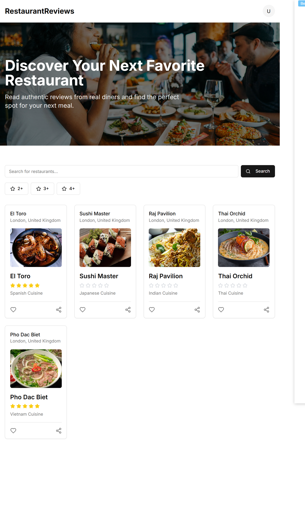
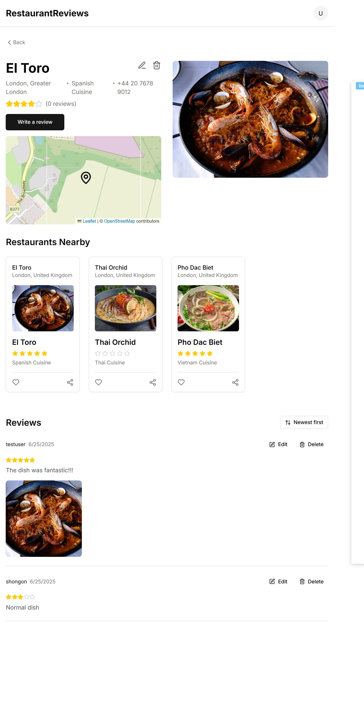
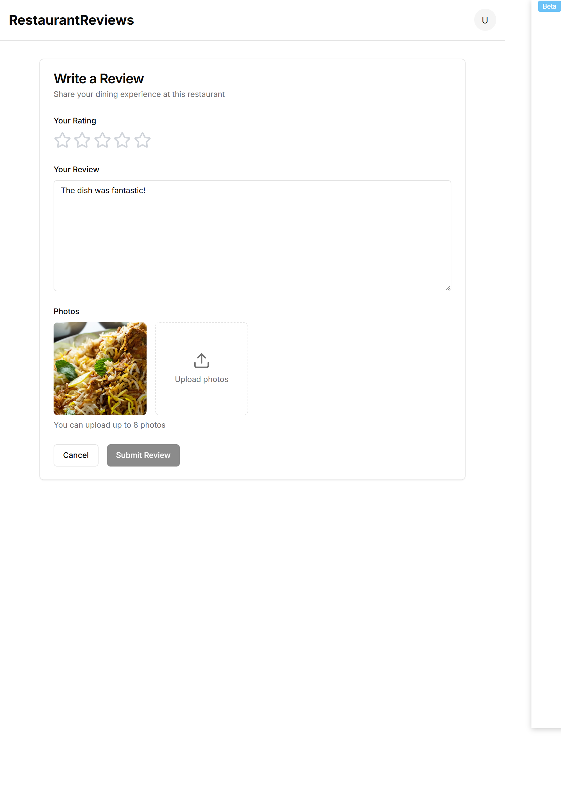
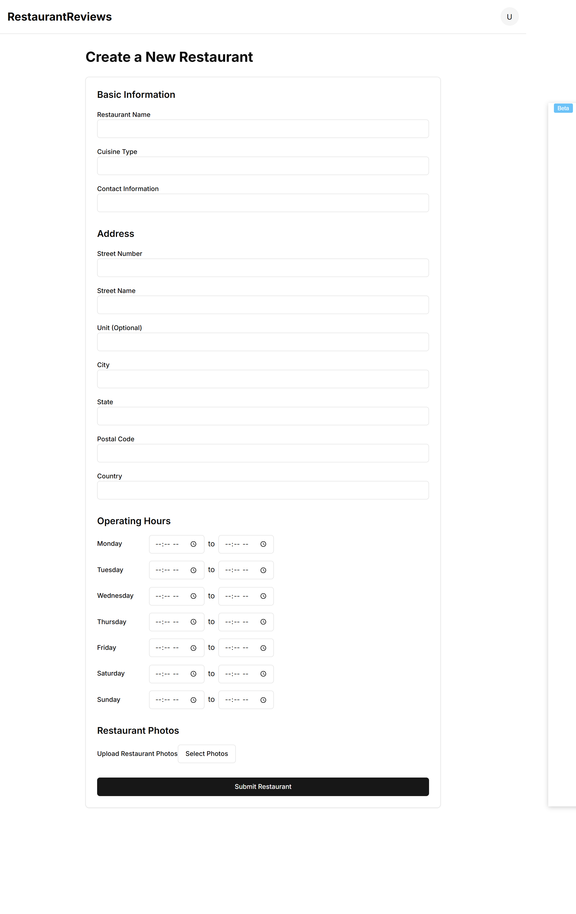

# Restaurant Review Platform (Backend)

Welcome to the backend codebase for the Restaurant Review Platform! This project powers a web-based application where users can discover local restaurants, read and share authentic reviews, and make informed decisions about their dining experiences.

**Skip**: The `restaurant-frontend` folder is managed separately and not covered here.

---

## 🚀 Project Summary

The Restaurant Review Platform enables users to:
- **Discover** local restaurants with powerful search and filtering.
- **Read** reviews and ratings from real diners.
- **Share** their own experiences through detailed reviews and photos.

This backend implementation focuses on robust search capability, integrating **Spring Boot**, **Keycloak**, **Elasticsearch**, and **Kibana** for a secure, scalable, and insightful system.

---

## 🛠️ Tech Stack

- **Spring Boot** — RESTful backend APIs and business logic.
- **Keycloak** — Centralized authentication and authorization (OAuth2 & OpenID Connect).
- **Elasticsearch** — Full-text, fuzzy, and geospatial search for restaurants and reviews.
- **Kibana** — Search analytics and dashboarding for operational insights.

---

## 🗂️ Project Structure

```
restaurant-review-platform/
├── restaurant-backend/                  # Spring Boot backend
│   ├── src/
│   │   ├── main/
│   │   │   ├── java/
│   │   │   │   └── com/example/restaurant/
│   │   │   │       ├── controller/      # REST controllers
│   │   │   │       ├── domain/          # Domain objects (User, Restaurant, Review, etc.)
│   │   │   │       ├── repository/      # Data (Elasticsearch) repositories
│   │   │   │       ├── service/         # Business logic & services
│   │   │   │       └── config/          # Keycloak, Elasticsearch, etc.
│   │   │   └── resources/
│   │   │       ├── application.yml      # Spring Boot & ES config
│   │   │       └── static/uploads/      # Uploaded images
│   └── docker-compose.yaml
├── restaurant-frontend/                 # Frontend (provided)
└── .gitignore
```

---

## ⚙️ Configuration

### 1. **Spring Boot**
- All main configuration in `restaurant-backend/src/main/resources/application.yml`.
- Example:
  ```yaml
  application:
    upload:
      dir: restaurant-backend/uploads

  spring:
    elasticsearch:
     uris: http://localhost:9200
  ```

### 2. **Keycloak**
- Configure the Keycloak server separately (see [Keycloak Quickstart](https://www.keycloak.org/getting-started/)).
  - Update `application.yml`:
    ```yaml
    spring:
      security:
        oauth2:
          resourceserver:
            jwt:
              issuer-uri: http://localhost:9090/realms/restaurant-review
    ```
- Add Keycloak adapter dependency in `pom.xml`.

### 3. **Elasticsearch**
- Run Elasticsearch locally (default port `9200`) or use a managed service.
- Index mapping and settings are auto-created on startup or via migration scripts.

### 4. **Kibana**
- Connect Kibana to your Elasticsearch instance for search analytics and monitoring.
- Access via `http://localhost:5601`.

---

## ▶️ How to Run

### Prerequisites
- Java 17+
- Maven
- Docker (for Elasticsearch/Keycloak/Kibana, recommended)

### 1. **Start Supporting Services**

```bash
# Using Docker Compose (recommended)
docker-compose up -d
```

``docker-compose.yml``:
```yaml
services:
  elasticsearch:
    image: docker.elastic.co/elasticsearch/elasticsearch:8.12.0
    container_name: elasticsearch
    environment:
      - node.name=elasticsearch
      - cluster.name=es-docker-cluster
      - discovery.type=single-node
      - bootstrap.memory_lock=true
      - xpack.security.enabled=false
      - "ES_JAVA_OPTS=-Xms512m -Xmx512m"
    ulimits:
      memlock:
        soft: -1
        hard: -1
    volumes:
      - elasticsearch-data:/usr/share/elasticsearch/data
    ports:
      - "9200:9200"
    networks:
      - elastic

  kibana:
    image: docker.elastic.co/kibana/kibana:8.12.0
    container_name: kibana
    ports:
      - "5601:5601"
    environment:
      - ELASTICSEARCH_HOSTS=http://elasticsearch:9200
    depends_on:
      - elasticsearch
    networks:
      - elastic

  keycloak:
    image: quay.io/keycloak/keycloak:23.0
    container_name: keycloak
    ports:
      - "9090:8080"
    environment:
      KEYCLOAK_ADMIN: admin
      KEYCLOAK_ADMIN_PASSWORD: admin
      KC_DB: dev-file
    volumes:
      - keycloak-data:/opt/keycloak/data
    command: start-dev
    networks:
      - elastic

volumes:
  elasticsearch-data:
    driver: local
  keycloak-data:
    driver: local

networks:
  elastic:
    driver: bridge
```

### 2. **Configure Keycloak**
- Import the provided realm configuration or manually set up:
  - Realm: `restaurant-review`
  - Client: `restaurant-app-backend`
     ```
     In General Settings:
       client id = restaurant-review-app
     In Capability config:
       only check☑️  Standard-flow.
       rest everything will be unchecked and off.
     In Login Setting:
       Root URL = http://localhost:3000
      Valid redirect URI = http://localhost:3000/*
      Valid post logout redirect URIs = http://localhost:3000
      Web origins = http://localhost:3000
     ```
  - Users, Roles: `user`, `owner`, etc.

### 3. **Run the Backend**

```bash
cd restaurant-backend
mvn spring-boot:run
```
- The API will be available at `http://localhost:8080/api`.

---

## 🔑 Authentication

- All API endpoints (except login/register) are protected via Keycloak.
- Use the frontend or tools like Postman to retrieve a Bearer token and access the API.

---

## 🧩 Core Domain Model

- **User**
  - `id`, `name`, `email`
  - Roles: owner, reviewer
- **Restaurant**
  - `id`, `name`, `cuisineType`, `contactInfo`
  - `address` (nested: street, city, geo)
  - `operatingHours` (nested by day)
  - `photos` (array of Photo)
  - `reviews` (array of Review)
  - `averageRating`
- **Review**
  - `id`, `content`, `rating` (1-5)
  - `author` (User)
  - `photos`
  - `createdAt`, `editedAt`
- **Address**
  - `streetNumber`, `streetName`, `unit`, `city`, `state`, `postalCode`, `geoLocation`
- **OperatingHours**
  - Map of days to open/close times
- **Photo**
  - `url`,`uploadDate`

### 🔗 Relationships
- One User ⟷ Many Restaurants (owner)
- One Restaurant ⟷ Many Reviews
- One Review ⟷ Many Photos
- One Restaurant ⟷ One Address, One OperatingHours

### 🔍 Elasticsearch Model
- Each Restaurant is a top-level document.
- Address, reviews, photos are nested fields for optimal search and filtering.

---

## 🔎 Search Features

- **Fuzzy search**: Find restaurants even with typos in names/cuisines.
- **Geospatial search**: Locate nearby restaurants using geo-coordinates.
- **Filtering/sorting**: By rating, cuisine, distance, etc.
- **Review management**: Editable within 48 hours of submission.

---

## 🖼️ Frontend Previews

> _Frontend is maintained in the `restaurant-frontend` folder._

|                  Home Search                  |                Restaurant Detail                |                  Review Model                   |                  Admin Model                   |
|:---------------------------------------------:|:-----------------------------------------------:|:-----------------------------------------------:|:----------------------------------------------:|
|  |  |  |  |

---

## 📚 Resources

- [Devtiro - Build a Restaurant Review Platform with Spring Boot](https://www.youtube.com/watch?v=rki0eVGAVTQ&t=12s)
- [Spring Boot Documentation](https://spring.io/projects/spring-boot)
- [Keycloak Documentation](https://www.keycloak.org/docs/)
- [Elasticsearch Guide](https://www.elastic.co/guide/en/elasticsearch/reference/current/index.html)
- [Elasticsearch - Java Master](https://www.youtube.com/watch?v=a4HBKEda_F8)
- [Kibana Guide](https://www.elastic.co/guide/en/kibana/current/index.html)

---

## 📝 License

Copyright © 2025. All rights reserved.

---